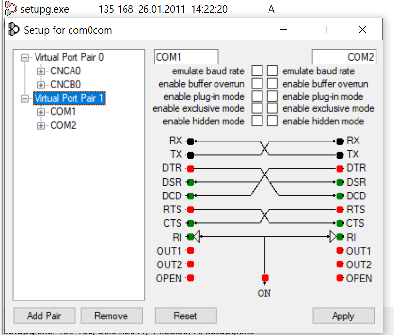

# zebra-bridge
Redirect ZPL programs from a virtual COM port to a networked Zebra printer

This is a very simple program that you'll hopefully never need, unless you are
stuck with an old piece of software that expects your Zebra printer to be
attached to a real COM port.


## Instalation
Download and install [Python 3](https://www.python.org/downloads/).
Once installed, use pip to install `pyserial`:
```
pip3 install pyserial
```


## Usage
Use [`com0com`](http://com0com.sourceforge.net/) to link 2 virtual COM ports
together. The program that wants to print uses one of the ports (e.g. `COM1`),
and this script listens on the other one (`COM2`).



I had some issues with com0com 3.0.0.0 (unsigned driver), so I used
[com0com 2.2.2.0-x64-fre-signed](https://sourceforge.net/projects/com0com/files/com0com/2.2.2.0/)
instead.

```
> python zebra-bridge.py --help
usage: zebra-bridge.py [-h] [--port PORT] COM host

A simple program for redirecting ZPL print jobs from a virtual COM port to a
networked Zebra printer over TCP.

positional arguments:
  COM                   the virtual serial port created by com0com
  host                  the printer's IP address

optional arguments:
  -h, --help            show this help message and exit
  --port PORT, -p PORT  TCP port the printer listens on (default: 9100)
```

Start the script on COM2 with a printer at 192.168.1.3:
```
> python zebra-bridge.py COM2 192.168.1.3
```


## Description
The printer closes incoming TCP connections after a while. TCP keepalive does
not help. To avoid problems, we have to open the connection when we get `^XA`
and then close it again at `^XZ`.

Reading stuff from the printer is not supported. Writing data is enough to get
a label printed, but do not expect `^XA^HH^XZ` to return anything. The printer
will send a response, but this simple script will just ignore it.
